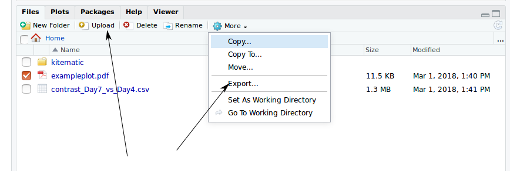

# Overview of the Docker container system


Sheffield R meetup - 6th March 2018

Longer version of materials prepared for CRUK Cambridge available [here](https://bioinformatics-core-shared-training.github.io/docker-4-bioinformatics/)

Mark Dunning (@DrMarkDunning)
Bioinformatics Core Director

### Sheffield Bioinformatics Core
web : [sbc.shef.ac.uk](https://sbc.shef.ac.uk)  
twitter: [@SheffBioinfCore](https://twitter.com/SheffBioinfCore)  
email: [bioinformatics-core@sheffield.ac.uk](bioinformatics-core@sheffield.ac.uk)

## Basics

https://docs.docker.com/engine/docker-overview


[Docker](https://www.docker.com) is an open platform for developers to build and ship applications, whether on laptops, servers in a data center, or the cloud.

- Or, it is a (relatively) painless way for you to install and try out Bioinformatics software. 
- You can think of it as an isolated environment inside your exising operating system where you can install and run software without messing with the main OS
    + potentially a good way for beginners to learn command-line tools?
- Really useful for testing software
- Clear benefits for working reproducibly
    + instead of just distributing the code used for a paper, you can effectively share the computer you did the analysis on
- For those of you that have used Virtual Machines, it is a similar concept
- However, they are more lightweight and easier to distribute
- Images are combined in a layered system

## Installing Docker

### Mac

- [Mac OSX - 10.10.3 or newer](https://www.docker.com/docker-mac)
- [Older Macs](https://download.docker.com/mac/stable/DockerToolbox.pkg)

### Windows

(may require some messing around with virtualisation or Hyper-V)

- [Windows 10](https://www.docker.com/docker-windows)
- [Older Windows](https://download.docker.com/win/stable/DockerToolbox.exe)


Once you have installed Docker using the insructions above, you can open a terminal (Mac) or command prompt (Windows) and run the following to download an image for the Ubuntu operating system from [Dockerhub](www.dockerhub.com);

```
docker pull ubuntu
```

To run a command inside this new environment software we can do;

```
docker run ubuntu echo "Hello World"
```
:tada::tada:

- run the docker container for the Ubuntu operating system
- run the `echo` command within this operating system
- exit

To use the container in interactive mode we have to specify a `-it` argument. Which basically means that it doesn't exit straight away, but instead runs the `bash` command to get a terminal prompt


```
docker run -it --rm ubuntu
```
- the `--rm` means that the container is deleted on exit, otherwise your disk could get clogged up with lots of exited containers
- if no command is specified, you get a shell prompt

- the `ubuntu` image (or `centos`) is often used as a base image upon which other more complicated images are based
- when you want another image, you only have to download the changes that have been made 
        + i.e. don't need to download `ubuntu` again
- more compact images, easier to distribute
- compare to virtual machine


## Volumes in Docker

You'll notice that when you launch a container, you don't automatically have access to the files on your OS. In Docker, we can mount *volumes* using the -v argument to make files accessible e.g. `-v /PATH/TO/YOUR/data:/data` inside the container.

```
## should say that no file or directory exists
docker run --rm ubuntu ls /data

## If on Windows, need correct path separator
docker run --rm -v c:\work:/data ubuntu ls /data

## On Unix it would be something more sensible, like

docker run --rm -v c/home/USER/work:/data ubuntu ls /data

```

## Running R (and RStudio) through Docker

The latest version of R and R devel are provided by the rocker project https://github.com/rocker-org/rocker

```
docker run --rm -it r-base R
```
- pull the latest `r-base` image, if you don't have it
- run interatively (`-it`)
- run the `r-base` docker image
- run the `R` executable

For latest developmental version of R:-

```
docker run --rm -it r-devel R
```

Can also [get previous versions of R](https://hub.docker.com/r/library/r-base/tags/)

- good if you need to re-run code that was written on a previous R version
- good if you need to test code on latest version of R


RStudio is also supported. See https://github.com/rocker-org/rocker/wiki/Using-the-RStudio-image

- this time we do something slightly different

```
docker run -p 8787:8787 rocker/rstudio
```
- the `-p` argument opens a port in the docker container
- open a web browser and enter the address `http://localhost:8787`
- username `rstudio` password `rstudio`
- you have a version of RStudio working in your web browser!

You can install whatever R packages you need in this container and analyse your data

N.B. Python fans needn't feel left out; there are docker containers for [jupyter](https://hub.docker.com/r/jupyter/notebook/) too.

- you can mount a volume with `-v`.
    + or there is an Upload option in the file viewer
- data (and scripts etc) can be exported with the Export menu item




Once a docker container has quit, you can jump back in with `docker start` and `docker attach`


```
docker ps ##not name of container that just quit
docker start <name-of-container-that-just-exited>
docker attach <name-of-container-that-just-exited>
```

You can then build a new image 

```
docker commit <name-of-container-that-just-exited> <new image>
```

There may already be a docker container for popular sets of tools

- e.g. the [tidyverse](https://hub.docker.com/r/rocker/tidyverse/)
- [bioconductor](https://hub.docker.com/r/bioconductor/release_base/)

## The `Dockerfile`

The creation of Docker images is specified by a Dockerfile. This is a text file containing the sequence of instructions required to re-create your image from some starting point, which could be the standard Ubuntu image. Essentially we list the commands we use, step-by-step to install all the software required. If you already have a shell script to install your software, then translating to a Dockerfile is relatively painless.

A useful reference is the [official Docker documentation on Dockerfiles](https://docs.docker.com/engine/reference/builder/), which goes into far more detail than we will here.

The example below shows the Dockerfile used to create a Ubuntu image use git to clone a repository and install some packages

```
FROM ubuntu
MAINTAINER YOU NAME<your.name@sheffield.ac.uk>
RUN apt-get update
RUN apt-get install -y wget build-essential git
RUN git clone.....
RUN R -e 'install.packages(....)'
```

The `docker build` command will build a new image from a `Dockerfile`. With `docker push` you can distribute this on [dockerhub](http://www.dockerhub.com) once you have a user name.

```
docker build -t=my_username/my_new_image .
docker push
```

## Use Case 1:- Distributing software for a training course

Several headaches can emerge when preparing the materials for a training course

- if the course venue has no desktop machines, participants will need to bring their own machines
    + so they will need to install software beforehand
    + challenging for beginners
- docker presents a potential solution
    + (however, they will still need to install docker - which could still be a barrier for some)
- distributing materials to other participants who can't make the class, or who want to attend remotely
- when developing materials in a team, need to agree on common software versions etc

```
docker run --rm -p 8787:8787 markdunning/cancer-genome-toolkit
```

## Use Case 2:- Distributing supplementary data for a publication

- Stephen Eglen of Department of Applied Mathematics and Theoretical Physics, University of Cambridge made the data and code for his paper available [on github](https://github.com/sje30/waverepo) :+1:
- furthermore, the scripts, data are available *with the appropriate version of R* [as a docker container](https://hub.docker.com/r/sje30/waverepo/) :+1::+1:

```
docker run -d -p 8787:8787 sje30/waverepo
```

## The elephant in the room...


Sounds great so far! But...

- when you run a Docker container you have super-user access rights inside that container. Unix admin people that manage HPC systems don't like this.

There is an alternative....

Singularity


